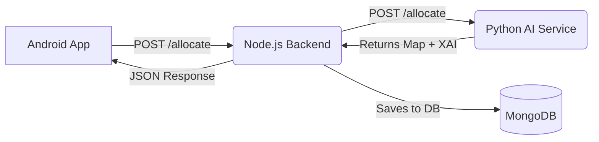

# SmartBus AI 🚌🧠

**Intelligent Seat Allocation & Transportation Management System**

SmartBus AI is a full-stack application designed to optimize passenger seating for bus administrators. By leveraging Machine Learning and Explainable AI (XAI), it automates complex seating logistics—prioritizing accessibility for the elderly and disabled while ensuring families and groups sit together.

---

## 🚀 Key Features

* **🤖 AI-Powered Allocation:** Automatically assigns seats based on passenger profiles (Age, Gender, Disability, Group).
* **📢 Explainable AI (XAI):** Provides transparent, human-readable reasons for every seat decision (e.g., *"Priority seating assigned due to age"*).
* **♿ Accessibility First:** Intelligently reserves and assigns wheelchair/accessible spots.
* **👨‍👩‍👧 Group Cohesion:** Algorithms penalty-check to keep families and groups seated together.
* **🔄 Continuous Learning:** Includes a feedback loop where post-trip ratings retrain the global models.
* **📱 Modern Android UI:** Built with Jetpack Compose for a smooth, reactive administrator experience.
* **📊 Trip History:** Comprehensive dashboard to view past trips, passenger manifests, and occupancy stats.

---

## 🛠️ Tech Stack

### **Frontend (Android)**
* **Language:** Kotlin
* **UI Framework:** Jetpack Compose (Material3)
* **Architecture:** MVVM (Model-View-ViewModel)
* **Networking:** Retrofit2 & OkHttp
* **DI:** Hilt (Dependency Injection)

### **Backend (Middleware)**
* **Runtime:** Node.js
* **Framework:** Express.js
* **Database:** MongoDB (Mongoose)
* **Role:** Orchestrates communication between the App and the AI Engine; manages history and feedback storage.

### **AI Engine (Microservice)**
* **Language:** Python 3.10
* **Framework:** FastAPI
* **ML Libraries:** Scikit-learn (Random Forest, Voting Classifier), Pandas, NumPy
* **Deployment:** Docker

---

## 🏗️ Architecture

The system follows a **Microservices Architecture**:

1.  **Android App:** Client-side interface for Admins to input passenger data or upload CSVs.
2.  **Node.js Server:** Acts as the API Gateway. It logs bookings to MongoDB and forwards allocation requests to the AI service.
3.  **Python AI Service:** The "Brain." It receives the payload, runs the optimization algorithms, generates explanations, and returns the seat map.



---

## ⚙️ Installation & Setup

### Prerequisites
* Android Studio Ladybug (or newer)
* Node.js & npm
* Python 3.10+
* MongoDB Atlas URI

### 1. Python AI Service
```bash
cd models/SmartBus-AI
pip install -r requirements.txt

# Train initial models (Cold Start)
python -m src.train_global_models

# Run the API
uvicorn src.api:app --reload --host 0.0.0.0 --port 8000
```
### 2. Node.js Backend
```bash
cd backend
npm install

# Create a .env file
# MONGO_URI=your_mongodb_connection_string
# PYTHON_SERVICE_URL=http://localhost:8000

node server.js
```

### 3. Android App
1. Open the project in **Android Studio**.
2. Navigate to `BackendAPIConnector.kt` and update `BASE_URL` to point to your Node.js server (use `10.0.2.2` if running locally on emulator).
3. Sync Gradle and run on an emulator or physical device.

---

## 🧪 API Endpoints

### Node.js Gateway
* `POST /allocate` - Main endpoint to trigger seat optimization.
* `GET /bookings` - Fetch trip history for the admin dashboard.
* `POST /feedback` - Submit ratings to retrain the model.

### Python Service
* `POST /allocate` - Runs the ML logic and returns assignments.
* `GET /health` - Checks if ML models (`.pkl` files) are loaded.

---

## 🤝 Contributing

Contributions are always welcome!

1. Fork the repository.
2. Create a feature branch (`git checkout -b feature/AmazingFeature`).
3. Commit your changes.
4. Open a Pull Request.

---

## 📄 License

Distributed under the MIT License. See `LICENSE` for more information.

**Developed by Aditya and Sreenandan Sashidharan**
